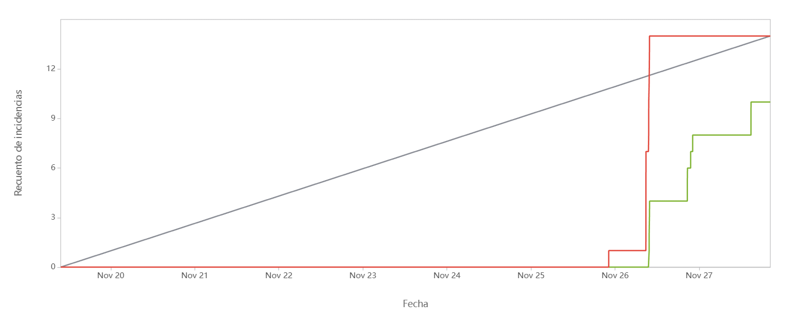
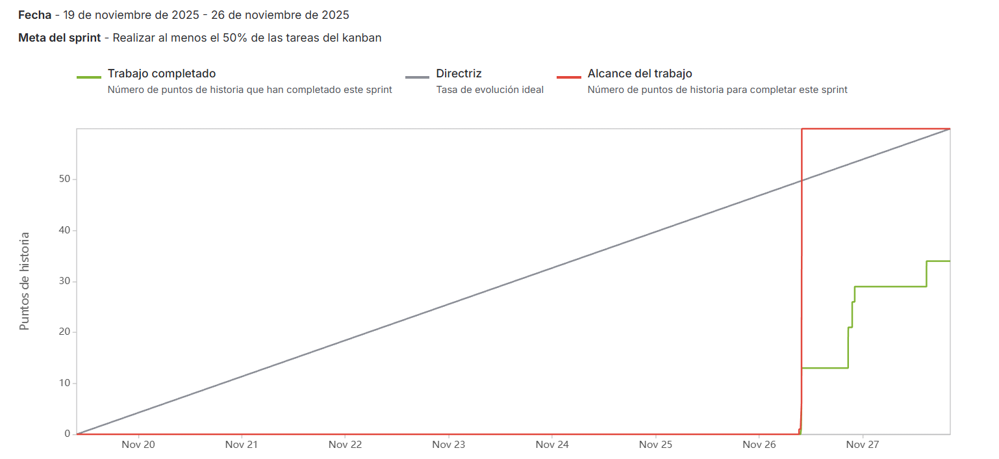
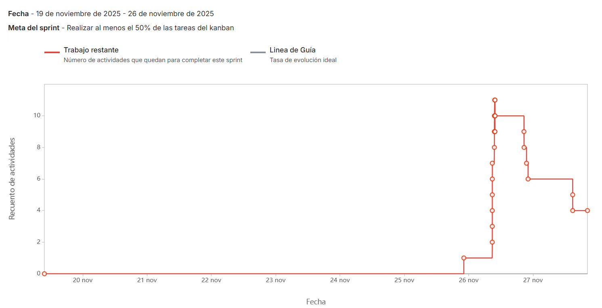

# Documentación del Proceso de Desarrollo y Metodología

## 1. Metodología Ágil Implementada

Para el desarrollo de este proyecto, se ha establecido una metodología híbrida que combina prácticas de **Scrum** y **Kanban** (Scrumban), gestionada a través de Jira Software.

### 1.1 Estructura de Trabajo
* **Sprints:** Se trabaja en iteraciones de tiempo fijo (Sprints) con una duración de **1 semana (se hicieron dos sprints)**.
* **Gestión Visual:** Se utiliza un tablero Kanban para visualizar el flujo de las tareas y limitar el trabajo en curso (WIP).

---

## 2. Estrategia de Ramificación (Branching Strategy)

Se utiliza el modelo **GitFlow** adaptado para soportar múltiples entornos de despliegue (CI/CD). El repositorio mantiene las siguientes ramas persistentes y temporales:

### Ramas Principales (Persistentes)
| Rama | Entorno | Descripción |
| :--- | :--- | :--- |
| **`main`** | Producción | Contiene código estable y versionado listo para el usuario final. |
| **`stage`** | Pre-Producción | Rama de pruebas finales (UAT) antes de pasar a producción. Refleja lo que será liberado. |
| **`develop`** | Desarrollo | Rama de integración principal. Aquí convergen todas las nuevas funcionalidades. |

### Ramas de Soporte (Temporales)
* **`feature/<nombre-historia>`:** Nacen de `develop`. Se utilizan para desarrollar nuevas funcionalidades o historias de usuario. Se integran mediante *Pull Requests*.
* **`hotfix/<id-error>`:** Nacen de `main`. Se usan para corregir errores críticos en producción de forma inmediata.

### Flujo de Trabajo
1. Desarrollo de funcionalidad en rama `feature`.
2. Pull Request y Code Review hacia `develop`.
3. Despliegue automático en entorno de **Desarrollo**.
4. Promoción de código estable de `develop` a `stage` para pruebas de aceptación.
5. Fusión final a `main` para despliegue en **Producción**.

---

## 3. Gestión de Proyectos (Jira)

### 3.1 Flujo del Tablero (Workflow)
Las historias de usuario transitan por los siguientes estados para asegurar la calidad:

1.  **Backlog:** Tareas pendientes priorizadas.
2.  **Por hacer:** Tareas seleccionadas para el Sprint actual.
3.  **En progreso:** Desarrollo activo / Coding.
4.  **En revisión:** El código está en revisión por pares (Pull Request).
5.  **Listo:** Aprobado en producción y cumple con el *Definition of Done*.

### 3.2 Definición de Historia de Usuario
Todas las tareas siguen el formato estándar para asegurar valor al usuario:

> **Título:** SCRUM - Nombre descriptivo
> * **descripcion:** Breve descripción de la historia de usuario.

### 3.3 Criterios de Aceptación 
Para considerar una historia como "Terminada" (Done), debe cumplir:
* Todos los criterios de aceptación funcionales.
* Pruebas unitarias/integración aprobadas en el pipeline.
* Code Review aprobado (mínimo 1 reviewer).
* Despliegue exitoso sin errores en el entorno correspondiente.

---

## 4. Reporte de Iteraciones (Sprints)

A continuación, se documenta la evidencia de las iteraciones clave realizadas durante el desarrollo.

### Sprint [1]: [Inicio de proyecto]
* **Objetivo:** Instalar la mayoria de herramientas y priorizar terraform.
* **Periodo:** 19 de noviembre de 2025 - 26 de noviembre de 2025

#### Métricas y Reportes
* **Historias Completadas:** 10 de 14
* **Puntos de Historia:** 34 de 60

**Gráfica de Burndown / Reporte de Jira:**

> *Esta gráfica demuestra el avance diario de las tareas contra el tiempo estimado (la linea roja es lo que se esperaba, la linea verde es lo que se logro)*

> *Esta gráfica demuestra el avance diario de los puntos de historia contra el tiempo estimado (la linea roja es lo que se esperaba, la linea verde es lo que se logro)*

 

> *Esta gráfica demuestra el avance del trabajo restante (WIP) contra el tiempo estimado (la linea roja es la cantidad de trabajo)*

---

### Sprint [2]: Terminar el proyecto
* **Objetivo:** Terminar de implementar las tecnologías restantes y terminar el proyecto. Además, documentar las cosas y crear los patrones.
* **Periodo:** 26 de noviembre de 2025 - 1 de diciembre de 2025

#### Métricas y Reportes
* **Historias Completadas:** [Cantidad]
* **Puntos de Historia:** [Cantidad]

**Gráfica de Velocidad / Flujo Acumulado:**
> *[ESPACIO RESERVADO: PEGAR AQUÍ IMAGEN DEL REPORTE DE JIRA SPRINT 2]*
> *(Esta gráfica evidencia la consistencia del equipo y el flujo de tickets entre estados)*

