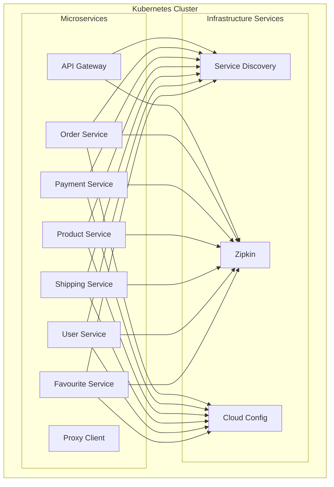

# Terraform Infrastructure for Ecommerce Microservices

This directory contains the Terraform configuration to manage the Kubernetes infrastructure for the Ecommerce Microservices application.

## Architecture

The infrastructure is designed using a modular approach, with a generic `microservice` module used to deploy each service.



## Directory Structure

- `modules/`: Contains reusable Terraform modules.
  - `microservice/`: Generic module for deploying a Spring Boot microservice.
- `environments/`: Contains environment-specific configurations.
  - `dev/`: Development environment (local backend).
  - `stage/`: Staging environment.
  - `prod/`: Production environment (configured for remote backend).

## Usage

### Prerequisites

- [Terraform](https://www.terraform.io/downloads.html) installed.
- [Kubernetes](https://kubernetes.io/) cluster running (e.g., Docker Desktop, Minikube).
- `kubectl` configured to point to your cluster.

### Deploying to Dev

1. Navigate to the dev environment directory:
   ```bash
   cd terraform/environments/dev
   ```

2. Initialize Terraform:
   ```bash
   terraform init
   ```

3. Plan the deployment:
   ```bash
   terraform plan
   ```

4. Apply the changes:
   ```bash
   terraform apply
   ```

### Remote Backend

The `prod` environment is configured with a placeholder for a remote S3 backend. To enable it:

1. Open `terraform/environments/prod/backend.tf`.
2. Uncomment the `backend "s3"` block.
3. Configure your bucket name, key, and region.
4. Ensure you have AWS credentials configured in your environment.
